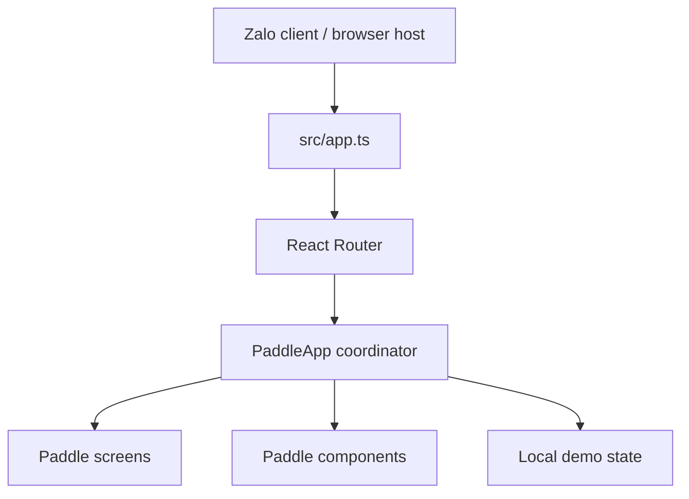

# Architecture and File Ownership

## Application flow

The active application is a frontend-only Paddle Sport demo. `src/app.ts` loads
ZaUI, Tailwind, and app styles before mounting React Router. The single route in
`src/router.tsx` renders `PaddleApp` at `/` with the environment-aware basename
from `src/utils/zma.ts`.

## Routes

| Path | Page         | Behavior                                                                      |
| ---- | ------------ | ----------------------------------------------------------------------------- |
| `/`  | Paddle Sport | Renders the three swipeable primary tabs and all associated workflow screens. |

The primary tabs are rendered in one horizontal track, so switching between
`Trang chủ`, `Buổi chơi`, and `Cá nhân` retains their mounted UI state. The
footer navigation is part of this tab shell.

## Paddle module structure

`src/pages/paddle/` owns the complete Paddle Sport frontend:

| Location       | Responsibility                                                                                                  |
| -------------- | --------------------------------------------------------------------------------------------------------------- |
| `index.tsx`    | App coordinator, local state, tab swiping, navigation, and screen composition.                                  |
| `types.ts`     | Shared screen, role, time, and set-count types.                                                                 |
| `constants.ts` | Picker data, demo participants, and currency formatting helpers.                                                |
| `components/`  | Small shared UI primitives such as `MoneyInput` and `PaddleHeader`.                                             |
| `screens/`     | Page-level screens grouped by workflow: primary tabs, creation, session, scoring, payment, summary, and review. |

## State and interactions

The demo keeps its state locally in `PaddleApp`:

- Role selection: `host` or `player`.
- Session details: name, date, start time, cost mode, cost value/range, and optional set count.
- Session progress: check-ins, score saved state, and payment confirmation.
- Review state: venue/host star rating and next-set setting.
- Short user feedback is shown through a local toast state.

ZaUI components from `zmp-ui` are used for inputs, date/time selection, radio
buttons, checkboxes, text areas, and primary workflow actions. This demo does
not invoke host payment, sharing, or identity SDK integrations; those need a
confirmed backend and Zalo runtime contract before being implemented.

## Legacy cleanup

The previous generated catalog template, including `src/components/` and
`src/pages/home/`, was removed because it was no longer routed or imported.
New shared Paddle UI belongs under `src/pages/paddle/components/`, rather than
a global component folder.
