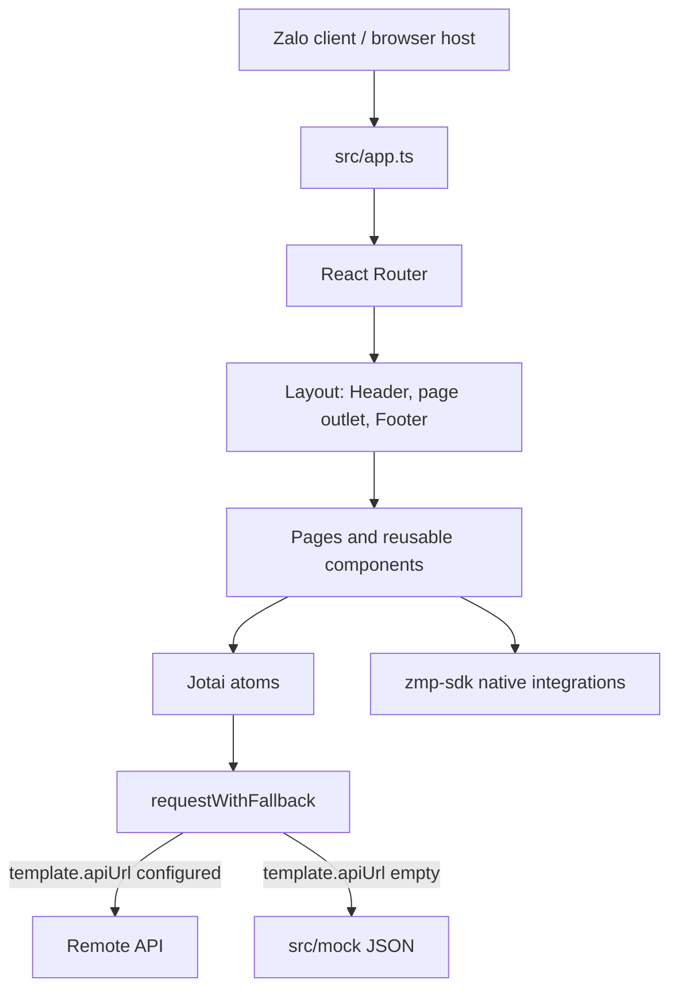

# Architecture and Data Flow

## High-level design

## Routes

All routes are defined in `src/router.tsx` beneath the shared `Layout`.

| Path            | Page           | Header behavior                                                                |
| --------------- | -------------- | ------------------------------------------------------------------------------ |
| `/`             | Home           | logo mode                                                                      |
| `/categories`   | Category list  | `Danh mục sản phẩm`; back disabled                                             |
| `/cart`         | Cart           | `Giỏ hàng`                                                                     |
| `/profile`      | Profile        | logo mode                                                                      |
| `/flash-sales`  | Product list   | `Flash Sales`                                                                  |
| `/category/:id` | Product list   | resolves the category name from loaded state                                   |
| `/product/:id`  | Product detail | uses the default header behavior; resets scroll for related-product navigation |
| `/search`       | Search         | `Tìm kiếm`                                                                     |

`src/utils/zma.ts` supplies the browser router base. It returns `/zapps/${window.APP_ID}` in production and known Zalo test/development host environments, and otherwise uses `window.BASE_PATH` or an empty string. Do not replace this with a fixed root path: deep links such as product sharing depend on Zalo-hosted routing.

## State

`src/state.ts` contains the central Jotai atoms.

| Domain          | Atoms / behavior                                                                                            |
| --------------- | ----------------------------------------------------------------------------------------------------------- |
| Current user    | `userState` calls `zmp-sdk.getUserInfo()` asynchronously.                                                   |
| Catalog         | `bannersState`, `categoriesState`, and `productsState`; product data is joined to its category.             |
| Product options | tabs, size, and color atoms; product-specific selection also lives in `useAddToCart()`.                     |
| Cart            | `cartState`, selected cart IDs, derived checkout items, and calculated total. Cart state is in memory only. |
| Search          | `keywordState` and `searchResultState`, which currently waits one second before filtering loaded products.  |

When adding a domain that is shared between pages, model it as a Jotai atom in `src/state.ts`. Keep derived values derived rather than duplicating them in component state.

## Data access

`src/utils/request.ts` provides `request<T>()` and `requestWithFallback<T>()`.

1. `getConfig()` reads `template.apiUrl` from `app-config.json`.
2. With a non-empty API URL, the client requests `${apiUrl}${path}`.
3. With an empty API URL, Vite imports matching JSON from `src/mock/` and uses the matching URL.
4. `requestWithFallback()` catches failures, logs warnings, and returns its supplied default value.

Current catalog endpoints are `/banners`, `/categories`, and `/products`. A backend replacement must preserve those data shapes or update `src/types.d.ts`, mocks, atoms, and page consumers together. New authenticated requests must implement the server and token contract required by the official Zalo authentication documentation; this template does not currently add an authorization header.

## UI composition

- `src/components/layout.tsx` owns the full-screen shell, header, scrollable route outlet, footer, toast layer, and scroll restoration.
- `src/components/header.tsx` reads route handles through `useRouteHandle()` and renders either a dynamic title/back control or logo mode.
- `src/components/footer.tsx` contains the bottom navigation and cart indicator.
- `src/pages/` holds page-level composition; `src/components/` holds reusable visual controls; `src/utils/` contains framework-independent helpers and host integration helpers.

## Important current behavior

- `useAddToCart()` merges cart lines with the same product and option combination; cart line IDs are generated from current array length and are not persistent.
- `useCheckout()` invokes the Zalo purchase API, then clears the in-memory cart only when the promise resolves.
- The project contains placeholder, inherited business copy and branding. In particular, logo-mode header text is a test label. Do not assume it is approved product content.
